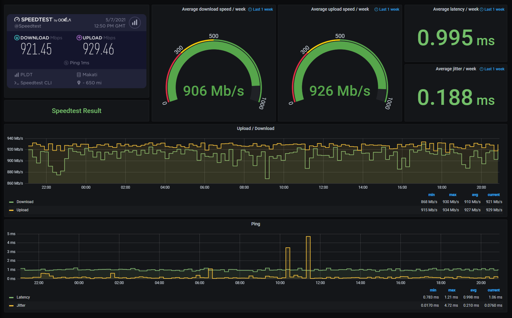

# Yet another Speedtest-to-InfluxDB Docker thing

This is just a culmination of a lot of Speedtest-related stuff on GitHub and improved on it, just so I can have a means of reporting it to my ISPs when they start to act funny. I'm currently using this on my homelab/mini-datacenter.

The scripts are based from valki2's [Speedtest docker container](https://github.com/valki2/Speedtestplusplus), but using the official Speedtest CLI instead of taganaka's [SpeedTest++](https://github.com/taganaka/SpeedTest). Modified it further to include the results embed/link when sending it over to InfluxDB.

The Grafana dashboard is based from frdmn's [dashboard](https://github.com/frdmn/docker-speedtest-grafana), and customized a bunch.

## Installation

> **Note:** When you first run it, you'll notice that nothing happens for the first minute. This is normal; the script sleeps for a minute to give the machine a chance to calm down before it starts running a test.

### All-in-one, using Docker Compose (recommended)

The Docker Compose file includes InfluxDB and Grafana, with the datasource and dashboard configured.

Install Docker and Docker Compose, and then:

    git clone https://github.com/JMacalinao/speedtest-influx.git
    cd speedtest-influx
    sudo docker-compose up -d

You can access Grafana from <http://localhost:3000>.

### All-in-one, using Helm Chart

Coming soon. (Note to self: Stop being lazy so you can deploy this one with a chart instead of doing it manually!)

### Using the Dockerfile

    docker build -t speedtest-influx .
    docker run --restart=always speedtest-influx

## Usage

Environment variable | Default | Description
-------------------- | ------- | -----------
`INFLUXDB_URL` | `http://influxdb:8086` | Hostname and port to InfluxDB
`INFLUXDB_DB` | `speedtest` | Database name
`SPEEDTEST_HOST` | `local` | Name of Speedtest host
`SPEEDTEST_INTERVAL` | `3600` | Time to sleep in between runs; in seconds
`SPEEDTEST_SERVER` | `null` | SpeedTest server ID (You can get the ID of your preferred server through <https://www.speedtest.net/speedtest-servers.php>)

## To-dos/Wishlist

* Helm chart
* Run and record tests from multiple servers

## License

I'm kinda lazy to get into jargon, but basically, everything is provided as-is, and I am not liable if using this code bricks your device, causes a nuclear holocaust, or anything in between. The nearest one from that is MIT, so there ya go.
